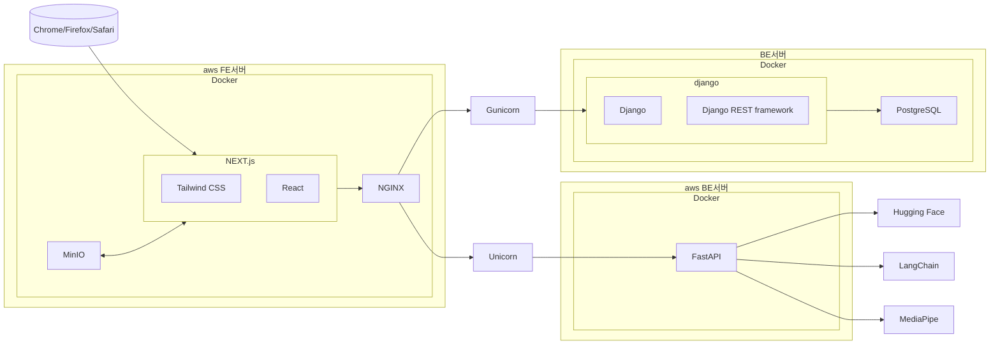

<!-- 중앙정렬 -->

<h1>
	<i> Fiton v2 </i>
</h1>
 

<h3>Fiton_v2에서 진행했던 내용들을 리뷰합니다.</h3>
<h4> <a href="https://github.com/2zm00/Fiton_v2">프로젝트는 여기에서 확인하실 수 있습니다. 👈</a></h4>

  

---
## 주요 기술 스택

| 영역         | 기술 스택                                                                 |
|--------------|--------------------------------------------------------------------------|
| **[프론트엔드](pplx://action/followup)** |                                                        |
| **[백엔드](pplx://action/followup)**    |                           |
| **데이터베이스** |               |
| **인프라**       |                                                    |
| **CI/CD**        |    |
| **웹 서버**      |  |
| **AI/ML**        |                                   |

---

## 프로젝트 내 역할

### 팀 리드
- WBS, Flowchart, ERD 설계, 커밋 컨벤션 문서화, API 연동 정의서, 기능 명세서, GithubProject Milestone을 통해 팀원들과의 협업 커뮤니케이션을 이끌었습니다.

### 프론트엔드 
- React, Next.js 기반 개발 환경 구축하고 반응형 UI/UX를 설계하였습니다.
- RestAPI 연동과 훅을 이용한 상태관리를 구현하였습니다.
- SEO 최적화 및 성능을 개선하였습니다.

### 백엔드
- FastAPI 기반 AI 모델 API와 운동자세 분석 기능을 구현하여 성능 최적화와 데이터 처리속도 개선했습니다.
- Langchain과 HuggingFace 기반 AI 챗봇 서비스를 개발하였습니다.
- Google Mediapipe 기반 운동 자세 분석 기능을 도입하였습니다.

	(비동기 처리 지원으로 기존 Django 사용 대비 응답시간 40% 단축, 초당 처리량 300% 향상,  20% 메모리 사용량 절감 )

### 인프라
- 프론트엔드/스토리지 서버를 AWS EC2로 운영하였습니다. AWS S3 스토리지 비용문제 이슈를 MinIO를 도입하여 비용을 절감했습니다.

	( 월 23$의 비용을 0$으로 절감 매 월 1TB 스토리지 100만 GET 요청 EC2 프리티어 인스턴스 기준)
- MSA 아키텍처를 구조를 아키텍처 구조를 통해 애자일하게 관리했습니다. 

	(프론트엔드 / 백엔드 / 데이터베이스 / 스토리지)
- TDD 기반 모킹 데이터를 통해 안정적인 아키텍처를 구축했습니다.
### CI/CD
- Github Actions를 활용한 CI/CD 파이프라인을 구현하였습니다.
- Docker 컨테이너 기반 배포 프로세스를 구축하여 배포 장애율이 66% 감소하였습니다. 

	(배포시간이 평균 1800s 에서 600s으로 단축)

- GitHub Pull Request 기반 코드 리뷰 과정에서 ChatGPT 자동화 코드 리뷰 기능을 도입하였습니다.

	(PR당 평균 리뷰 시간을 180분에서 30분(70%)으로 감소)

---

## 기술문서화
- WBS 

	(API 연동 정의서, 기능 명세서 등을 확인하 실 수 있습니다.)

- 시스템 아키텍처

- Github Project Milestone 작성

- FlowChart 작성

